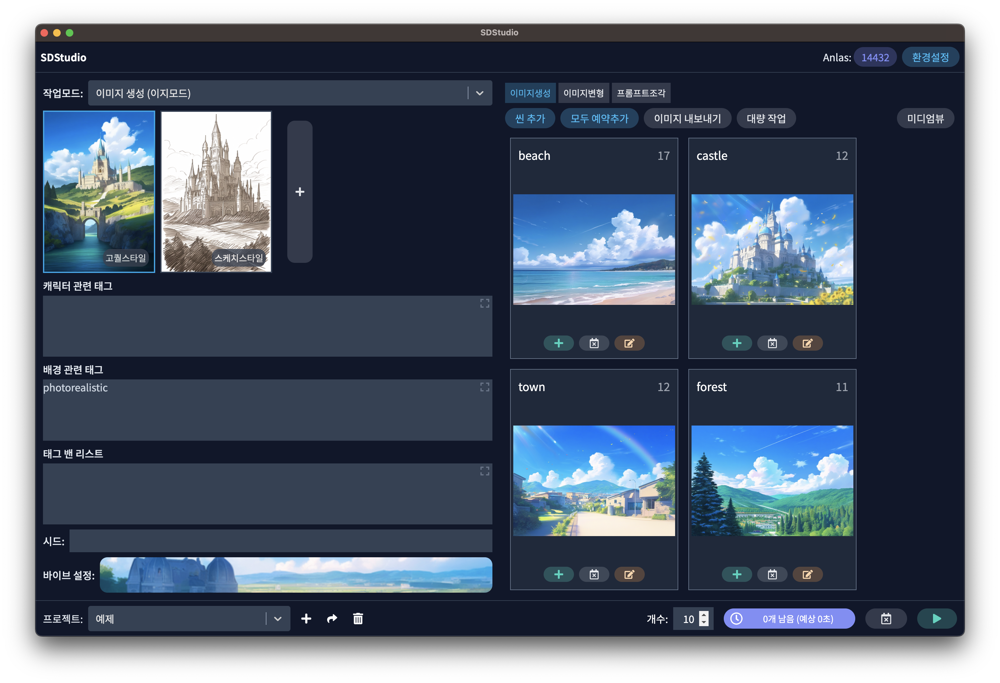
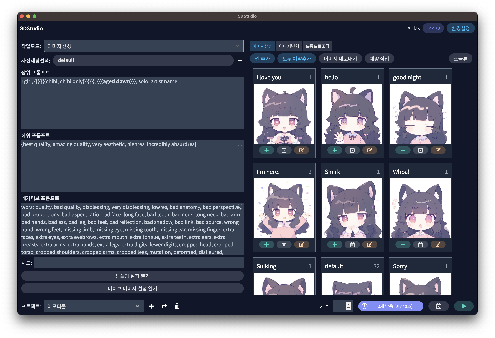
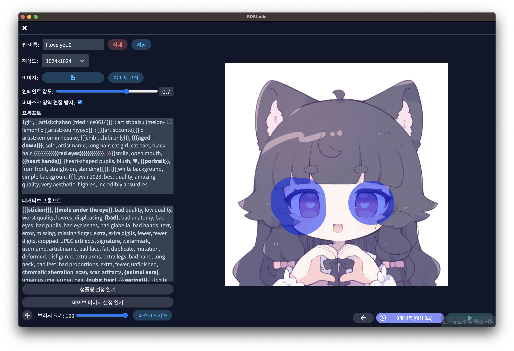
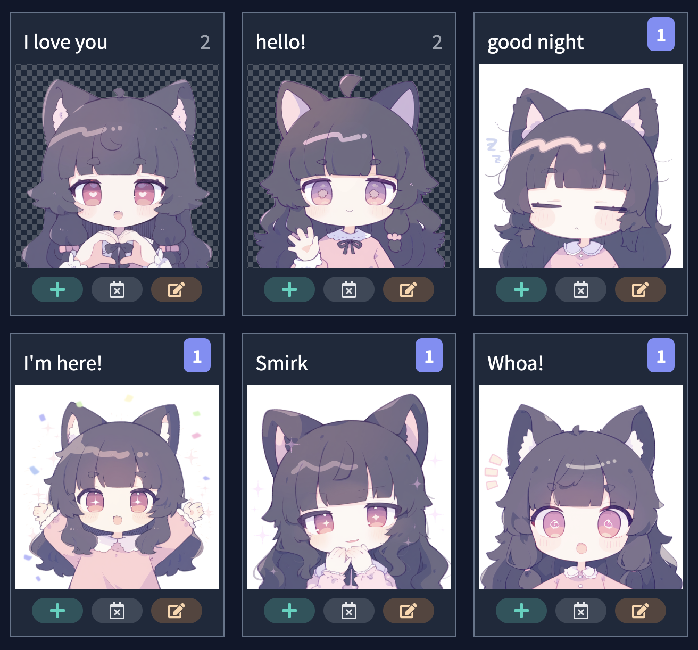
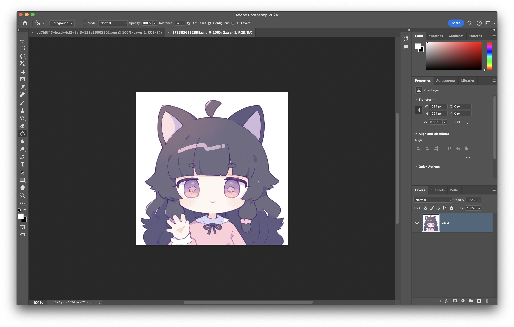
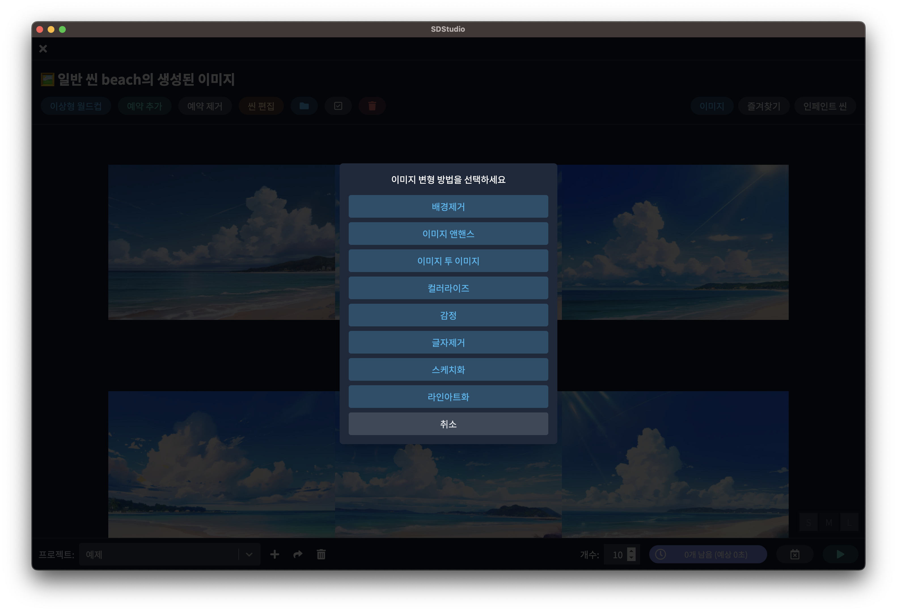
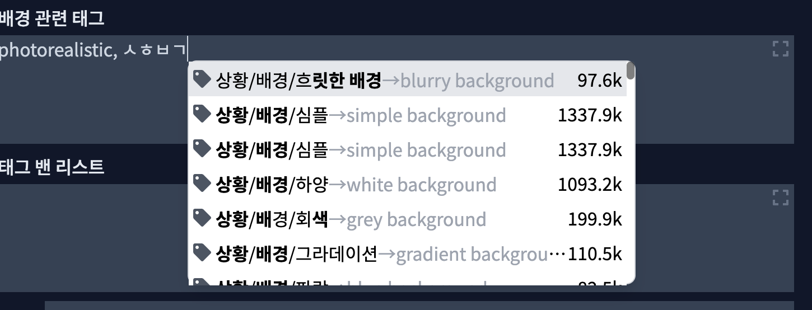
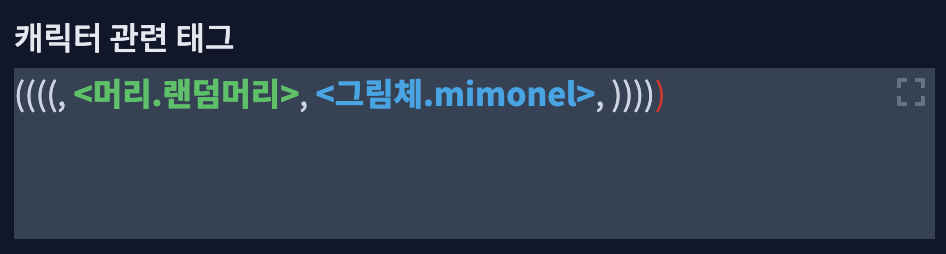
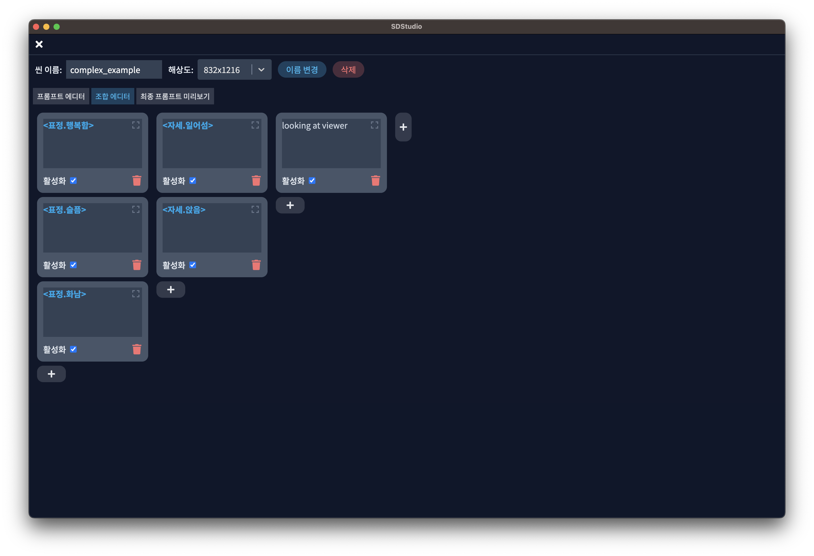

# 소개
Stable Diffusion 계열 API와 모델을 사용하기 편하게 해주는 프론트앤드 프로그램입니다. 모든 씬을 여러번 생성 예약을 해놓고 딴거하다가 와서 이미지를 이미지 월드컵으로 선택하고 리터칭하는 작업 흐름에 맞춰져 있습니다.

## 주요 기능

### 씬 별 이미지 생성

### 이미지 월드컵 기능

	
### 이미지 인페인팅 기능

### 자동 배경 제거 기능

### 포토샵 연동 기능

### 이미지 변형 기능

### 태그 자동 완성

###  프롬프트 조각 및 구문 하이라이팅 기능

### 프롬프트 조합 기능

## 크래딧

이미지 씬 기능은 https://dendenai.xyz 의 프리셋 기능에서 파생되었습니다.
